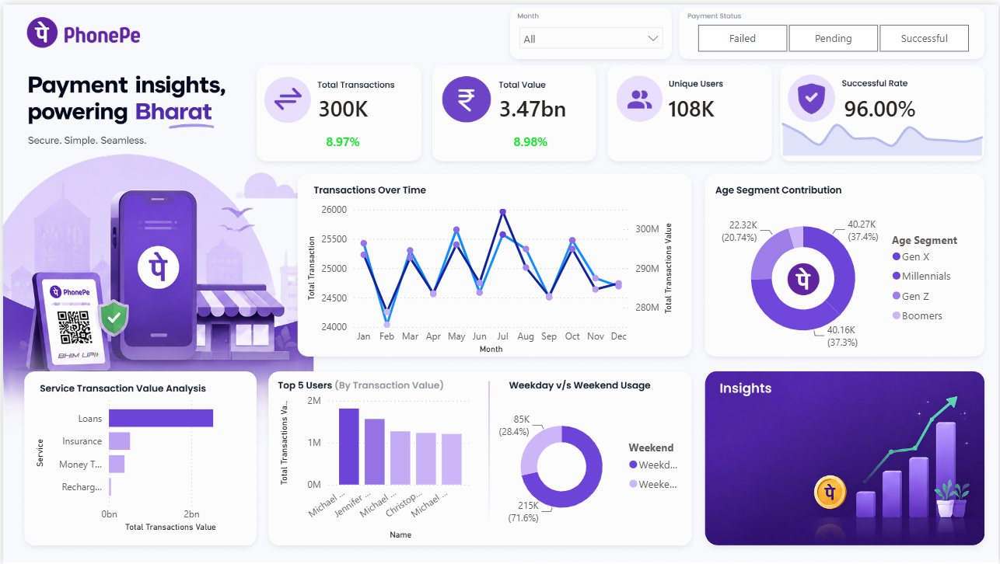

# PhonePe Transaction & Customer Analytics

An end-to-end data analytics project focused on analyzing digital payment transactions and customer activity using **SQL, Power BI, and Excel**.

The project analyzes **300,000+ transaction records** to understand transaction trends, transaction value, payment performance, service-wise activity, and high-value customer behaviour.

---

## 📌 Project Overview

Digital payment platforms generate large volumes of transaction data that can be used to understand customer behaviour and payment performance.

This project analyzes PhonePe-style digital payment data to answer key business questions such as:

- How many transactions are being processed?
- What is the total transaction value?
- How does transaction activity change over time?
- Which services contribute the most transaction value?
- What is the overall payment success rate?
- What are the major reasons for failed transactions?
- Which users generate the highest transaction value?
- How does customer activity vary across different user groups?

The analysis was performed using SQL for data analysis and Power BI for interactive visualization.

---

## 🎯 Business Objectives

The main objectives of this project are:

1. Analyze overall transaction volume and transaction value.
2. Track monthly transaction trends.
3. Evaluate payment success and failure performance.
4. Compare transaction activity across different services.
5. Identify high-value and highly active customers.
6. Build an interactive dashboard for business performance monitoring.

---

## 📊 Dataset

The dataset contains two main tables:

### 1. Users Table

Contains customer-level information including:

- User ID
- Name
- Age
- Join Date

### 2. Transactions Table

Contains transaction-level information including:

- Transaction ID
- Transaction Amount
- User ID
- Service
- Service Type
- Payment Status
- Reason
- Transaction Date

### Dataset Scale

| Metric | Value |
|---|---:|
| Registered Users | 107,658 |
| Transactions | 300,000 |
| Transaction-active Users | 100,761 |
| Service Categories | 4 |
| Transaction Period | January–December 2024 |

---

## 🛠️ Tools & Technologies

- **SQL** – Data analysis, KPI calculation, filtering, aggregation, joins and business analysis
- **Power BI** – Interactive dashboard and data visualization
- **Excel** – Source dataset and initial data inspection

---

## 🔍 Analysis Performed

### 1. Transaction Analysis

Analyzed:

- Total transaction count
- Total transaction value
- Average transaction value
- Monthly transaction trends
- Monthly transaction value

### 2. Payment Performance Analysis

Evaluated:

- Successful transactions
- Failed transactions
- Overall payment success rate
- Failure reasons
- Payment performance across different services

### 3. Service Analysis

Compared:

- Transaction volume by service
- Transaction value by service
- Average transaction value by service
- Service-level payment performance
- Detailed service-type activity

### 4. Customer Analysis

Analyzed:

- Total registered users
- Transaction-active users
- Customer transaction frequency
- Customer transaction value
- High-value customers
- Customer-level transaction behaviour

---

## 📈 Key KPIs

The dashboard tracks the following major KPIs:

- **Total Transactions**
- **Total Transaction Value**
- **Average Transaction Value**
- **Active Users**
- **Payment Success Rate**
- **Service-wise Transaction Value**
- **Monthly Transaction Trends**

---

## 📊 Power BI Dashboard

The Power BI dashboard provides an interactive view of transaction and customer performance.

### Dashboard includes:

- KPI cards
- Monthly transaction trend
- Transaction value analysis
- Service-wise performance
- Payment status analysis
- Payment failure analysis
- High-value customer analysis
- Interactive filtering

### Dashboard Preview



---

## 💡 Key Insights

The analysis highlights several important patterns in the transaction data:

- The dataset contains **300,000 transactions** generated by more than **100,000 transaction-active users**.
- Payment performance is dominated by successful transactions, with an overall success rate of approximately **96%**.
- Transaction activity varies across service categories, while transaction value can differ significantly from transaction volume.
- Monthly analysis helps identify changes in transaction activity throughout the year.
- Customer-level analysis helps identify users contributing high transaction value and users with high transaction frequency.
- Failure-reason analysis provides visibility into the major causes of unsuccessful payment attempts.

---

## 🗂️ Project Structure

```text
PhonePe_Transaction_Customer_Analytics/
│
├── PowerBI/
│   ├── PhonePe_Dashboard.png
│   └── PhonePe_Transaction_Customer_Analytics.pbix
│
├── SQL/
│   ├── 01_Data_Validation.sql
│   ├── 02_KPI_Analysis.sql
│   ├── 03_Monthly_Analysis.sql
│   ├── 04_Service_Analysis.sql
│   ├── 05_Payment_Analysis.sql
│   └── 06_Customer_Analysis.sql
│
├── PhonePe-Final-Dataset.xlsb
│
└── README.md
```

---

## 🚀 Project Workflow

```text
Excel Dataset
      ↓
Data Inspection & Validation
      ↓
SQL Analysis
      ↓
KPI & Business Analysis
      ↓
Power BI Data Model
      ↓
Interactive Dashboard
      ↓
Business Insights
```

---

## 📌 SQL Analysis

The SQL scripts included in this repository cover:

- Data validation
- Transaction KPIs
- Monthly trend analysis
- Service-wise analysis
- Payment performance
- Customer activity
- High-value customer analysis

Examples of SQL concepts used:

```text
SELECT
WHERE
GROUP BY
ORDER BY
COUNT()
COUNT(DISTINCT)
SUM()
AVG()
CASE WHEN
JOIN
```

---

## 📋 How to Use This Project

### Step 1 — Dataset

Open the dataset available in the `Data` folder.

### Step 2 — SQL Analysis

Open the SQL scripts in the `SQL` folder and execute the queries using your SQL environment.

### Step 3 — Power BI

Open:

```text
PowerBI/PhonePe_Transaction_Customer_Analytics.pbix
```

to explore the interactive dashboard.

---

## 🎓 Learning Outcomes

Through this project, I developed practical experience in:

- SQL-based data analysis
- Data validation and cleaning
- KPI development
- Customer and transaction analysis
- Business-focused data interpretation
- Power BI dashboard development
- Translating raw data into actionable insights

---

## 👤 Author

**Himendra Pal Singh**

B.Tech Biotechnology  
National Institute of Technology, Raipur

### Skills Used

`SQL` `Power BI` `Excel` `Data Analysis`

---

## ⭐ Project Highlights

- 300,000+ transaction records analyzed
- 100,000+ transaction-active customers
- Transaction, customer and payment-performance analysis
- SQL-based business analysis
- Interactive Power BI dashboard
